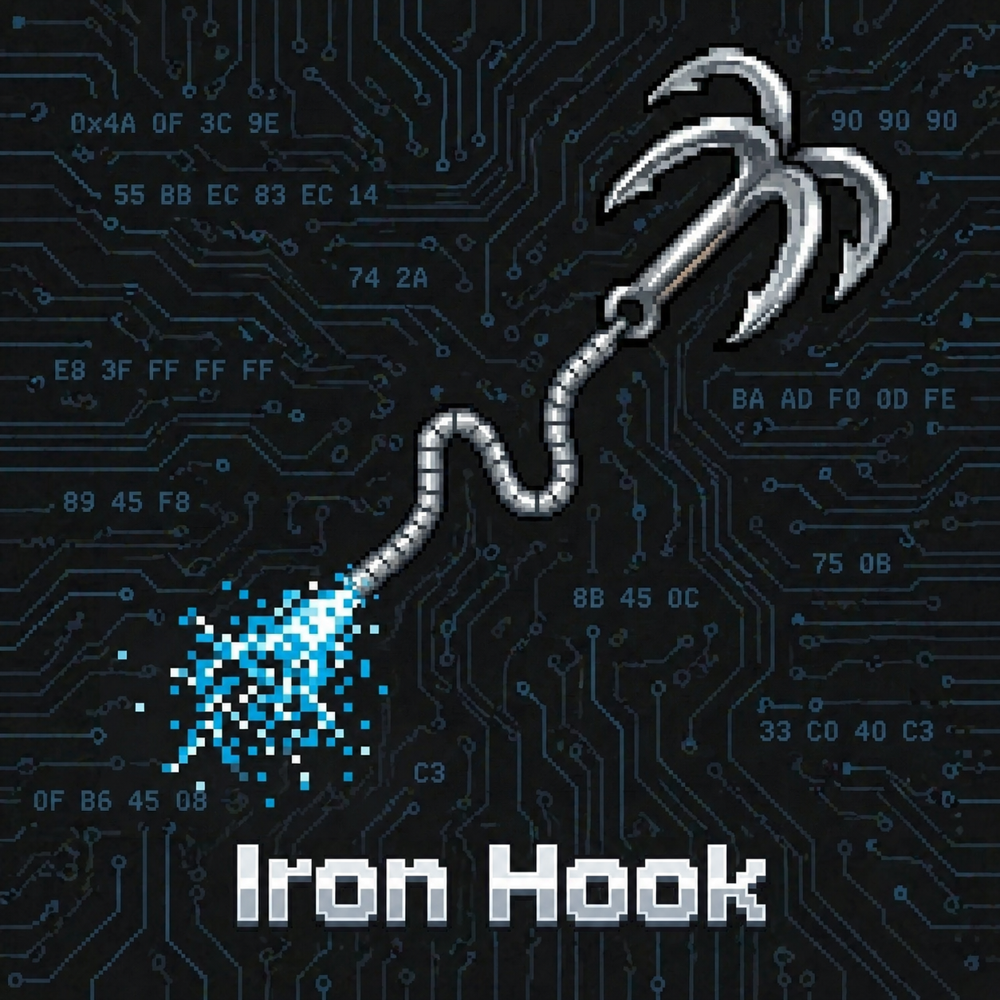

# IronHook

## Members

- [Yuqi Fan PB24000188](https://github.com/Rosaya-qwq)
- [Yifei Xiong PB24000048](https://github.com/USTC-XeF2)
- [Qifan Zhong PB24010467](https://github.com/C6-H14)
- [Anqiao Li PB24010490](https://github.com/Kurisu934)
- [Jiawen Liang PB24000358](https://github.com/juicyname)

## Project Introduction

IronHook is a high-performance, security-grade inline hook library designed specifically for the Android ARM64 architecture.

IronHook aims to solve the memory safety risks and complex call chain management problems of traditional C hook frameworks in multi-threaded environments by leveraging Rust's ownership model and RAII (Resource Acquisition and Initialization) mechanism.

# Project Icon

## Schedule

| **Project Phase** | **Date** | **Project Progress** | **Task Allocation** |
| :--- | :--- | :--- | :--- |
| **Topic Confirmation** | 3.23 | Communicated with the supervisor and received approval to officially set the project topic as: "Rewriting ByteDance's open-source `android-inline-hook` project using Rust." | Clarified the final direction and overall goals of the project. The team wrapped up the topic selection phase and transitioned to researching the underlying source code of the original project. |
| **Preliminary Research** | 4.7 | Held an online meeting to discuss the architecture of the original `android-inline-hook` project, planning to thoroughly investigate its underlying implementation details and mechanisms. | Assigned tasks to team members to deeply analyze the original source code, focusing on its core C/C++ logic and the principles of the Hook mechanism to lay the foundation for the subsequent Rust porting. |
| **Feasibility Research** | 4.13 | Held an offline meeting. Based on previous code research, the team decided to adopt a progressive refactoring strategy, prioritizing the rewrite of the core Hook layer. | 1. Divided tasks to draft the feasibility analysis report (covering technical routes, difficulty analysis, etc.);   2. Planned the setup of the Rust cross-compilation and testing environment to conduct technical validation for the initial Hook layer rewrite. |
