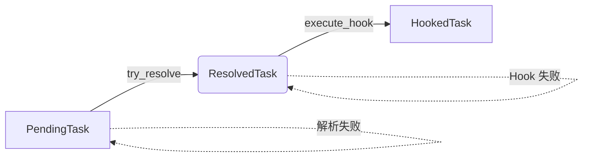

# 📦 任务调度与地址解析模块

本模块负责 IronHook 的前置任务挂起、Android ELF 符号的内存寻址，以及驱动底层 Hook 的状态流转。

## 🌟 架构亮点：类型状态机 (Typestate)

为了在编译期彻底杜绝“在库未加载时强行 Hook”引发的段错误 (Segfault)，本模块重构了核心业务流。我们将任务的生命周期物理隔离为三个结构体。

**状态流转图：**

> **设计约束**：
> 1. `PendingTask` 绝对没有 `target_addr` 字段。
> 2. 下游的底层模块，强制要求传入 `ResolvedTask`，从 API 签名层面保证了传入的地址绝对合法！

---

## 🤝 给队友的对接指南

### 1. 给上游（API 层）的接口
如果你是外部接口层的开发者，请直接调用 `add_hook_task`，不需要你手动管理队列或状态：

```rust
use ironhook::task_manager::task::add_hook_task;

// 直接下发任务，引擎会自动尝试解析并分发
add_hook_task("libc.so", "open", 0x11112222);
```

### 2. 给下游（Module 1/2 跳板与指令重写）的约定接口
如果你是负责写汇编跳板或修改内存权限的队友，**请你务必提供并实现以下接口**：

```rust
use ironhook::task_manager::task::{ResolvedTask, HookedTask};

/// ⚠️ 你的函数签名必须是这个样子！
pub fn execute_hook_by_teammates(task: ResolvedTask) -> Result<HookedTask, String> {
    // 你可以放心地直接使用 task.target_addr，它绝对是真实有效的物理地址
    let target_memory = task.target_addr;
    
    // ... 你的底层内存修改逻辑 ...
    
    Ok(HookedTask {
        lib_name: task.lib_name,
        sym_name: task.sym_name,
    })
}
```

## 🛠️ 当前真机运行状态
- [x] 基于 `/proc/self/maps` 的正则表达式基地址提取。
- [x] 基于 `goblin` 的动态符号表 `.dynsym` 偏移解析。
- [x] Android 真实 ARM64 手机环境测试通过。

