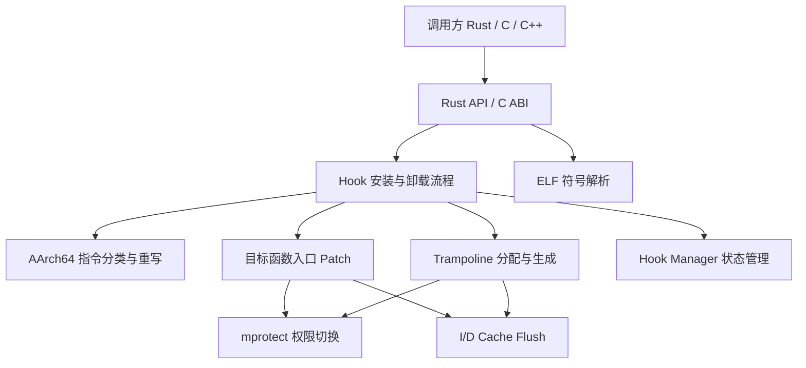

# IronHook：结题报告

## 1. 摘要

IronHook 是一个面向 Android AArch64 平台的 inline hook 库，项目目标是以 Rust 重新实现 ByteDance Android inline hook / ShadowHook 一类框架的核心机制，在保持底层执行效率和 Android NDK 集成能力的同时，利用 Rust 的类型系统、所有权模型和显式 `unsafe` 边界提升系统级 hook 代码的可维护性与安全性。

Inline hook 的核心思想是在运行时改写目标函数入口处的机器指令，使其跳转到用户提供的代理函数；同时框架需要生成 trampoline，将被覆盖的原始指令搬运到新的可执行内存区域，并在执行完被搬运的指令后跳回原函数后续位置。这个过程涉及代码页权限修改、AArch64 指令重定位、指令缓存刷新、动态库符号解析、跨语言 ABI 设计和 hook 生命周期管理，是一个典型的操作系统与体系结构交叉项目。

本项目当前实现了 V1 原型：支持 Android / AArch64 unique-mode inline hook，支持按函数地址 hook、按已加载 ELF 符号名 hook、原函数 trampoline 调用、unhook 恢复、Rust API、C ABI，以及 Android AAR 打包。项目同时提供了主机测试、Android target 构建验证和 QEMU user-mode 端到端验证脚本。

需要说明的是，IronHook 当前仍定位为课程项目和实验性原型，不建议直接用于生产环境。项目暂未实现 Arm32 / Thumb、shared / multi hook 链、instruction intercept、pending newly loaded ELF hook、完整操作记录以及 linker init / fini callback 等 ShadowHook 完整能力。

## 2. 小组成员以及分工

本项目成员的主要分工如下。实际开发过程中，各模块之间存在大量交叉协作，例如 AArch64 指令重写、trampoline 构建、内存权限切换和 C ABI 都会共同影响最终 hook 链路是否稳定，因此项目成果是团队持续联调、测试和修复后的整体产物。

**李安峤**：负责核心 hook 生命周期加固、Rust API 与 C ABI、Android AAR 打包、QEMU 验证脚本、toy validation app、API/验证/组织文档、分支合并与整体集成。

**钟启帆**：负责 Active Hooks Registry、重复 hook 管理、历史问题修复、编译告警修复。

**范宇祺**：负责 dev 分支中 AArch64 指令重写与测试改进、ELF 符号解析增强、hook / manager / memory 模块健壮性补充、跨页写入测试、QEMU 示例验证扩展，以及 README 与 DEV_GUIDE 开发文档维护。

**熊逸飞**：负责初始 demo、工程格式化、clippy 告警修复和早期工程搭建。

## 3. 立项依据

### 3.1 研究背景

随着 Android 系统底层安全机制不断收紧，移动端应用在性能监控、安全防御、非侵入式调试和逆向分析等场景下，仍然需要在 Native 层对函数调用进行运行时拦截。Inline hook 技术通过直接改写目标函数入口指令改变控制流，能够在不修改原始二进制文件的前提下实现函数替换和行为观测，因此长期被应用于 APM、安全 SDK、动态插桩和调试工具。

传统 Android inline hook 框架大多使用 C/C++ 实现。C/C++ 具备接近硬件的控制能力，但在直接操作代码页、裸指针、机器码和跨线程状态时，容易由于越界访问、非对齐写入、生命周期混乱或并发竞争引入不可预期崩溃。对于运行在目标进程内部的 hook 框架而言，任何未定义行为都可能直接导致宿主进程崩溃。

Rust 语言近年来已经被引入 AOSP 等系统级工程。它没有垃圾回收，具备零成本抽象能力，同时通过所有权、借用检查、`Result` 错误传播和显式 `unsafe` 机制，将内存安全风险集中在可审计的小范围内。本项目因此选择探索“用 Rust 重构 Android AArch64 inline hook 核心链路”的可行性。

### 3.2 业界研究现状与开源生态

#### 3.2.1 ByteDance android-inline-hook / ShadowHook

ByteDance Android inline hook / ShadowHook 是 Android Native hook 领域具有代表性的轻量级框架，面向 Android 常见 ABI 提供函数级 inline hook 能力。其优势在于轻量、贴近 Android 运行环境，并对 ARM / AArch64 指令修复和 hook 模式进行了工程化封装。

本项目参考了这类框架的基本思路：改写函数入口、构建 trampoline、管理 hook 生命周期、提供 C ABI，并保留对 ShadowHook 迁移接口的兼容思路。但 IronHook 并不是 ByteDance 官方项目，也没有追求在 V1 中完全复刻 ShadowHook 的所有能力，而是优先实现最核心、最可验证的 AArch64 unique hook 链路。

#### 3.2.2 Dobby

Dobby 是业界常用的动态 hook 框架，支持多平台、多架构和复杂的指令修复策略。它的工程成熟度高，覆盖范围广，但也更重，对课程项目而言完整复刻其能力并不现实。IronHook 从 Dobby 一类框架中吸收了 trampoline 和绝对跳转等基本思想，但在实现目标上选择更小的 V1 边界。

#### 3.2.3 Frida-gum

Frida-gum 是 Frida 动态插桩体系的核心底层组件，支持跨平台代码插桩、运行时拦截和脚本化调试。它功能强大，但系统复杂度远超本项目目标。IronHook 的定位不是构建完整动态插桩平台，而是聚焦 Android AArch64 inline hook 原语本身。

### 3.3 核心技术挑战

#### 3.3.1 内存权限与 W^X 约束

Android 代码段在加载后通常为可读可执行（RX）。要写入跳转指令，框架必须临时修改内存页权限。权限修改需要按页对齐，并且应尽量避免长期持有 W+X 权限。本项目在 trampoline 分配和目标函数 patch 写入中采用保守策略：trampoline 先以 RW 权限分配，写入完成后切换为 RX；目标函数 patch 时临时切为 RW，写入后恢复 RX 并刷新指令缓存。

#### 3.3.2 AArch64 指令重定位

Inline hook 会覆盖目标函数入口的若干条指令。为了让调用方仍能执行原函数，被覆盖指令必须被搬运到 trampoline。AArch64 中存在大量 PC-relative 指令，例如 `B`、`BL`、`B.cond`、`ADR`、`ADRP`、literal `LDR`、`CBZ/CBNZ`、`TBZ/TBNZ` 等。这些指令搬运到 trampoline 后，原先基于 PC 的位移会失效，必须重新计算目标地址并生成等价指令序列。

#### 3.3.3 指令缓存一致性

ARM 处理器常见实现中指令缓存和数据缓存分离。写入新的跳转指令后，如果不清理 D-cache 并失效 I-cache，CPU 可能继续执行旧指令。IronHook 在 AArch64 上通过内联汇编执行 `dc cvau`、`ic ivau`、`dsb` 和 `isb` 序列，保证代码修改对取指流水线可见。

#### 3.3.4 FFI 与 ABI 约束

Android Native 生态大量使用 C/C++ 和 JNI。纯 Rust API 不足以支撑集成，因此项目需要导出稳定 C ABI。与此同时，FFI 边界必须明确所有权：C 侧拿到的 hook stub 实际由 Rust 侧分配和管理，unhook 时再交回 Rust 释放，避免泄漏或重复释放。

### 3.4 创新点

1. **用 Rust 约束高危底层操作边界**：项目保留必要的裸指针、`mprotect`、`mmap`、机器码写入和内联汇编，但将这些操作集中在 `memory`、`hook`、`ffi` 等模块中，通过 `Result` 和明确错误类型向上返回失败原因。
2. **模块化 AArch64 指令重写器**：项目使用 Rust 枚举和模式匹配对 AArch64 指令类型进行分类，并为常见 PC-relative 指令生成重写序列，使 trampoline 构建逻辑比宏式 C 代码更易测试和维护。
3. **面向集成的双接口设计**：项目同时提供 Rust API、类型化 `Trampoline<T>`、RAII 风格 `HookGuard`，以及 C ABI 的 `ironhook_*` 接口和可选 `compat-shadowhook` 迁移别名。
4. **可验证的 Android 交付链路**：项目不仅实现核心库，还提供 Android AAR 打包、Prefab header 布局检查、QEMU user-mode smoke test 和主机侧 fmt/clippy/test 验证脚本。

## 4. 项目设计

### 4.1 系统架构

IronHook 的整体架构围绕一个 Rust 核心库展开，并向外提供 Rust API 和 C ABI 两层接口。



项目主要模块如下：

- `crates/ironhook/src/api.rs`：对外暴露 Rust API，包括 `Hook`、`HookOptions`、`HookMode`。
- `crates/ironhook/src/builder.rs`、`guard.rs`、`trampoline.rs`：提供更符合 Rust 使用习惯的 builder、RAII guard 和类型化 trampoline。
- `crates/ironhook/src/hook.rs`：实现 inline hook 安装和卸载主流程。
- `crates/ironhook/src/arch/a64.rs`：实现 AArch64 指令识别与重写。
- `crates/ironhook/src/memory.rs`：封装 `mmap`、`mprotect`、`munmap`、页对齐、patch 写入和 icache flush。
- `crates/ironhook/src/elf.rs`：解析当前进程已加载 ELF，支持按库名与符号名查找函数地址，也支持根据地址反查符号。
- `crates/ironhook/src/ffi.rs`：导出 C ABI 和错误码，并在 `compat-shadowhook` feature 下导出已实现的 ShadowHook 风格别名。
- `android/ironhook`：负责 Android AAR 打包，并注入 Prefab-compatible header 布局。
- `examples/test-hook` 和 `examples/toy-app`：提供 QEMU/Android 端到端验证程序。
- `scripts/verify_*.sh`：封装主机、Android 和 QEMU 验证流程。

### 4.2 Hook 生命周期设计

IronHook V1 只支持 unique 模式，即同一目标地址在同一时刻只能安装一个 hook。安装流程如下：

1. 检查目标地址和代理函数地址是否非空且满足 AArch64 指令 4 字节对齐要求。
2. 查询全局 `HookManager`，若目标地址已经被 hook，则返回 `AlreadyHooked`。
3. 备份目标函数入口处固定长度的原始指令字节。
4. 对入口指令进行分类，计算每条指令搬运到 trampoline 后所需的重写长度。
5. 分配 trampoline 内存，写入保存/恢复临时寄存器和重写后的原始指令。
6. 在 trampoline 尾部写入跳回原函数后续位置的绝对跳转序列。
7. 将 trampoline 内存从 RW 切换为 RX，并刷新指令缓存。
8. 生成跳转到代理函数的 patch 指令序列。
9. 将 hook 状态注册到全局 manager。
10. 临时修改目标函数所在页权限，写入 patch，恢复 RX 权限并刷新指令缓存。

卸载流程如下：

1. 根据目标地址从 manager 中取出 hook 状态。
2. 读取目标函数当前入口字节，确认仍然等于 IronHook 写入的 patch。
3. 若入口字节已被外部改写，返回 `VerifyMismatch`，避免覆盖其他模块的修改。
4. 写回备份的原始指令。
5. 释放 trampoline 内存。
6. 从 manager 中移除 hook 状态。

### 4.3 Rust API 设计

Rust API 提供两类入口：

- `Hook::by_address(target, replacement, options)`：按函数地址安装 hook。
- `Hook::by_symbol(library, symbol, replacement, options)`：先解析已加载 ELF 符号，再安装 hook。

`Hook` 在 `Drop` 中自动执行 unhook，避免使用者忘记卸载导致目标进程状态残留。更高层的 `HookBuilder` 和 `HookGuard` 进一步提供了 RAII 风格使用方式，调用方必须持有 guard 才能保持 hook 生效，guard drop 后自动恢复原函数。

### 4.4 C ABI 设计

C ABI 暴露在 `crates/ironhook/include/ironhook.h` 中，核心接口包括：

- `ironhook_hook_func_addr`：按函数地址 hook。
- `ironhook_hook_sym_addr`：按符号地址 hook。
- `ironhook_hook_sym_name`：按库名和符号名 hook。
- `ironhook_unhook`：卸载 hook。
- `ironhook_get_errno`、`ironhook_to_errmsg`：获取和解释错误码。

C ABI 使用整数错误码与 C 字符串，便于 Android NDK / C++ 工程集成。启用 Cargo feature `compat-shadowhook` 后，项目还会导出已实现的 `shadowhook_*` alias，用于迁移测试和接口兼容实验。

### 4.5 Android 打包设计

项目通过 Gradle 模块 `android/ironhook` 生成 Android AAR。打包流程会构建 `aarch64-linux-android` 目标下的 `libironhook.so`，并将头文件放入 Prefab-compatible 路径：

- `jni/arm64-v8a/libironhook.so`
- `prefab/modules/ironhook/include/ironhook.h`

这样 Android/NDK 集成方可以通过 AAR 获得 native 动态库和 C/C++ 头文件。

## 5. 核心实现

### 5.1 AArch64 指令分类与重写

`arch/a64.rs` 是项目最核心的模块之一。它将 AArch64 指令分为以下类型：

- 普通可直接搬运指令：`Ignored`
- 无条件与条件分支：`B`、`BL`、`BCond`
- 地址生成指令：`Adr`、`Adrp`
- Literal load：`LdrLit32`、`LdrLit64`、`LdrswLit`
- Prefetch 和 SIMD literal load：`PrfmLit`、`LdrSimdLit32/64/128`
- 条件比较/测试分支：`Cbz`、`Cbnz`、`Tbz`、`Tbnz`

对于普通指令，重写器直接复制原指令。对于 PC-relative 指令，重写器先解析立即数，计算原始目标地址，再根据目标地址是否落在被搬运的 backup 区间内进行处理：

- 若目标地址在 backup 区间外，则 materialize 绝对地址并使用 `BR/BLR` 或 load 序列跳转/访问。
- 若分支目标落在 backup 区间内，则通过 `fix_addr` 将其映射到 trampoline 中对应的重写后地址。
- 对于无法安全搬运的内部 literal 数据引用，重写器返回失败，hook 流程安全终止。

这种设计体现了可行性报告中的“宁可 hook 失败，不导致宿主崩溃”的策略。对于超出当前 V1 支持范围的复杂指令，项目不会盲目 patch，而是通过 `RewriteFailed` 将失败向上传递。

在 dev 分支开发过程中，我们对该模块进行了较大幅度补充。一方面修正了 `sign_extend_64` 在 33 位 `ADRP` 立即数等场景下的符号扩展逻辑；另一方面补充了向前/向后分支、backup 区间内部跳转、条件分支、`ADR/ADRP` 内部地址拒绝、literal load 内部数据引用失败等测试用例。这些改动使指令重写器不仅覆盖正常路径，也覆盖了 hook 框架最容易出错的边界路径。

### 5.2 Trampoline 构建

trampoline 是调用原函数的关键。IronHook 在安装 hook 时复制目标函数入口处固定长度的指令，并将其重写到新分配的可执行内存中。trampoline 头部和尾部会插入必要的寄存器保存/恢复和绝对跳转序列。

当前实现使用 X16 / X17 作为临时寄存器构建绝对跳转：

- 跳到代理函数：目标函数入口被写入 `LDR X16, #imm` + `BR X16` 形式的跳转序列。
- 跳回原函数：trampoline 尾部使用绝对地址跳回目标函数备份区之后的位置。

通过 `Trampoline<T>`，Rust 调用方可以将 trampoline 地址转换为原函数签名对应的函数指针，从代理函数或测试程序中调用原始实现。

### 5.3 内存权限管理与缓存刷新

`memory.rs` 封装了底层内存操作：

- `alloc` 使用 `mmap_anonymous` 分配 RW 内存。
- `make_rx` 将 trampoline 内存切换为 RX。
- `write_instructions` 对目标函数所在页执行 RW -> write -> RX -> clear icache。
- `checked_page_span` 处理非对齐地址和跨页 patch 范围。

项目没有让 trampoline 长期处于 W+X 状态；目标代码写入时也只在短时间内切为 RW，随后立即恢复 RX。这一策略比简单粗暴地使用 RWX 更符合现代 Android 的安全约束。

在 AArch64 平台上，`clear_icache` 读取 `ctr_el0` 获取 cache line 大小，随后对写入范围执行 D-cache clean、I-cache invalidate、`dsb` 和 `isb` 屏障，确保 CPU 后续取指能看到新写入的指令。

### 5.4 Hook Manager 与错误处理

`manager.rs` 使用 `Mutex<HashMap<usize, HookState>>` 记录当前活跃 hook。每个 `HookState` 保存：

- 被覆盖的原始入口字节 `backup`
- 写入目标函数的跳转字节 `exit`
- trampoline 地址 `enter`
- 目标函数地址

unique 模式下，重复 hook 同一个目标地址会返回 `AlreadyHooked`。unhook 时，IronHook 会先比对目标函数入口是否仍为自己写入的 patch，若不一致则返回 `VerifyMismatch`，避免覆盖其他框架或其他线程写入的代码。

错误类型集中在 `error.rs` 中，并映射到 C ABI 的 errno：

- `InvalidArgument`
- `AlreadyHooked`
- `MemoryAlloc`
- `MprotectFailed`
- `RewriteFailed`
- `NotFound`
- `VerifyMismatch`
- `Unsupported`

这种错误模型使 Rust 调用方必须处理失败路径，也让 C/C++ 调用方能通过 `ironhook_get_errno` 获取明确错误原因。

### 5.5 ELF 符号解析

`elf.rs` 实现了进程内已加载 ELF 的符号解析能力。调用方可以通过 `resolve_symbol("libc.so", "puts")` 获取符号地址，也可以通过 `resolve_addr(addr)` 根据地址反查符号信息。示例程序中使用该能力验证 IronHook 的解析结果与 `dlsym` 结果一致。

按符号名 hook 是 Android Native 侧常见使用场景。它避免调用方手动处理动态库基址和符号偏移，也使 C ABI 的 `ironhook_hook_sym_name` 能更贴近传统 hook 框架的使用方式。

dev 分支中对 ELF resolver 做了进一步增强：程序头不再直接按宿主结构体切片读取，而是结合 `goblin` 的 `Ctx` 和 `scroll` 按 ELF 上下文解析；GNU hash 解析补充了 bloom 参数校验、symbol count 估算和更稳健的符号表读取逻辑。这些修改提升了在 Android 真实进程内存布局下解析已加载动态库的可靠性。

### 5.6 Android 与 QEMU 验证工程

项目提供两个验证程序：

- `examples/test-hook`：以 Android `libc.so` 的 `puts` 为目标，验证符号解析、hook 安装、重复 hook 拒绝、代理函数拦截、trampoline 调用原函数、guard drop 自动 unhook、重新安装和自动恢复。
- `examples/toy-app`：覆盖 Rust API 地址 hook、C ABI 地址 hook、C ABI 符号 hook、重复 unique hook 错误、unsupported shared/multi mode 和重复 hook/unhook 循环。

项目还提供三个主要验证脚本：

- `scripts/verify_host.sh`：执行 `cargo fmt`、`cargo clippy`、workspace tests 和 `compat-shadowhook` feature tests。
- `scripts/verify_android.sh`：构建 `aarch64-linux-android` release 产物，组装 AAR，并检查 `.so` 与 header 是否正确进入包内。
- `scripts/verify_qemu.sh`：构建并通过 `qemu-aarch64` 运行 `test-hook` 和 `toy-app`。

## 6. 测试与效果验证

### 6.1 代码规模与项目产物

当前仓库中核心代码、示例、脚本和文档约 4965 行。其中主要代码规模如下：

| 模块 | 行数 | 说明 |
| :--- | ---: | :--- |
| `crates/ironhook/src/arch/a64.rs` | 840 | AArch64 指令分类与重写。 |
| `crates/ironhook/src/elf.rs` | 604 | 已加载 ELF 符号解析。 |
| `crates/ironhook/src/ffi.rs` | 404 | C ABI 与 ShadowHook 兼容别名。 |
| `crates/ironhook/src/task.rs` | 229 | 任务相关结构。 |
| `crates/ironhook/src/memory.rs` | 177 | 内存分配、权限切换和 icache flush。 |
| `crates/ironhook/src/hook.rs` | 118 | hook/unhook 主流程。 |
| `examples/test-hook/src/main.rs` | 164 | QEMU hook 示例。 |
| `examples/toy-app/src/main.rs` + `c_probe.c` | 437 | Rust API 与 C ABI 验证程序。 |
| `scripts/setup_sysroot.sh` | 380 | Android ARM64 sysroot 提取脚本。 |

最终产物包括：

- Rust crate：`ironhook`
- Android native library：`libironhook.so`
- Android AAR：`ironhook-android-release.aar`
- C/C++ header：`ironhook.h`
- 使用手册、API 文档、验证文档、项目组织文档和路线图

### 6.2 主机测试

主机测试用于验证纯逻辑模块和不依赖 Android runtime 的行为，主要覆盖：

- AArch64 指令分类。
- 分支、条件分支、`ADR/ADRP`、literal load、`CBZ/CBNZ`、`TBZ/TBNZ` 等指令重写。
- backup 区间内部跳转的 trampoline 地址修正。
- 不支持的内部 literal 数据引用失败路径。
- 内存页范围计算、跨页写入和零长度分配错误。
- manager 重复注册与移除。
- C ABI 初始化参数和空指针错误。

其中 dev 分支补充了独立的 `a64_rewrite_cases.rs` 和 `memory_cases.rs` 测试文件，重点验证 `ADRP` 符号扩展、内部跳转地址修正、内部 literal load 拒绝，以及 `write_instructions` 跨页 patch 能力。这部分测试直接对应调研报告中提出的“指令重写完备性”和“系统调用安全性”两个评测方向。

推荐命令：

```bash
bash scripts/verify_host.sh
```

该脚本会执行格式检查、clippy、workspace 单元测试和 `compat-shadowhook` feature 测试。

### 6.3 Android 构建验证

Android 构建验证用于确认项目能够产出 Android AArch64 目标库和可集成 AAR。

推荐命令：

```bash
bash scripts/verify_android.sh
```

该脚本会构建 `aarch64-linux-android` release 版本的 `ironhook`，执行 Gradle AAR 打包，并检查包内是否包含：

```text
jni/arm64-v8a/libironhook.so
prefab/modules/ironhook/include/ironhook.h
```

这说明项目已经完成从 Rust core 到 Android NDK 集成产物的基本闭环。

### 6.4 QEMU 端到端验证

QEMU 验证用于在 Android ARM64 runtime sysroot 上运行真实 AArch64 二进制，验证 inline patch 能否在目标架构上生效。

推荐命令：

```bash
export ROOTFS="$PWD/.local/sysroot"
bash scripts/verify_qemu.sh
```

验证内容包括：

- `puts` 函数被代理函数成功拦截。
- 代理函数返回值影响调用方结果。
- trampoline 调用原始 `puts` 时不会再次触发代理函数。
- guard drop 后 hook 自动卸载。
- unhook 后原函数行为恢复。
- 同一目标地址重复 unique hook 被拒绝。
- Rust API 地址 hook、C ABI 地址 hook、C ABI 符号名 hook 均可运行。
- shared / multi mode 按预期返回 unsupported。
- 重复 hook / unhook 循环通过。

dev 分支同时扩展了 `examples/test-hook`，将示例从单纯验证 hook 生效扩展为同时校验符号解析、地址反查、缺失符号失败路径、重复 hook 拒绝、unhook 后恢复、重新安装和 RAII 自动卸载。这使示例程序更接近端到端 smoke test，而不仅是演示代码。

示例程序期望输出包含：

```text
=== IronHook Android Demo ===
symbol resolver verified
hook installed (guard active)
duplicate hook rejected
verified: proxy no longer called after unhook
verified: reinstall and automatic unhook passed
=== All tests passed ===
```

### 6.5 使用示例

Rust 侧可以按已加载库符号安装 hook：

```rust
use std::ffi::{CStr, c_char};

use ironhook::{HookBuilder, HookGuard, Trampoline, resolve_symbol};

type Puts = extern "C" fn(*const c_char) -> i32;

extern "C" fn puts_proxy(s: *const c_char) -> i32 {
    let msg = unsafe { CStr::from_ptr(s) }.to_string_lossy();
    println!("[hooked puts] {msg}");
    msg.len() as i32
}

fn install_puts_hook() -> Result<(HookGuard, Trampoline<Puts>), ironhook::Error> {
    let sym = resolve_symbol("libc.so", "puts")?;
    HookBuilder::new(&sym, puts_proxy as *const () as usize).install()
}
```

C/C++ 侧可以通过头文件调用：

```c
#include <ironhook.h>

void *orig = NULL;
void *stub = ironhook_hook_func_addr(target, replacement, &orig);
if (stub == NULL) {
  int err = ironhook_get_errno();
  const char *msg = ironhook_to_errmsg(err);
}

ironhook_unhook(stub);
```

此外，项目维护了 `README.md` 和 `DEV_GUIDE.md` 两份面向使用者和开发者的文档。README 说明项目定位、当前支持范围、快速开始、API 概览和验证命令；DEV_GUIDE 则记录从空白 Linux / WSL2 开发机配置 Rust、Android SDK / NDK、QEMU sysroot 到运行 Android hook 示例的完整流程。这些文档保证后续成员或评测者能够复现构建与验证过程。

## 7. 最终项目与前期设计对比

### 7.1 调研阶段设想

调研报告中，我们提出了使用 Rust 重构 Android inline hook 框架的总体方向，重点关注以下问题：

1. C/C++ hook 框架在裸指针、手动内存管理和机器码写入中的安全风险。
2. Android 代码页权限修改必须满足页对齐和 W^X 约束。
3. AArch64 PC-relative 指令搬运是 trampoline 构建的核心难点。
4. ARM 指令缓存与数据缓存分离，写入 patch 后必须刷新缓存。
5. Rust 的枚举、模式匹配、`Result`、RAII 和 `unsafe` 边界可以提升该类底层库的可靠性。

这些判断基本都在最终实现中得到体现：项目没有停留在接口层，而是实际实现了 hook/unhook、trampoline、AArch64 指令重写、内存权限切换和 icache flush。

### 7.2 可行性分析阶段设想

可行性报告中计划将项目拆为四个基础模块：

1. 基础跳板内存分配与系统调用隔离。
2. ARM64 指令重定位基础引擎。
3. 代理执行中枢与状态管理。
4. 跨语言构建环境与联调测试。

最终项目与该规划高度一致：

- `memory.rs` 完成了内存分配、页保护、跨页写入和 cache flush。
- `arch/a64.rs` 完成了 AArch64 指令识别和常见 PC-relative 指令重写。
- `hook.rs`、`manager.rs`、`guard.rs`、`trampoline.rs` 完成了 hook 生命周期、状态管理和原函数调用路径。
- `ffi.rs`、`include/ironhook.h`、`android/ironhook`、`examples` 和 `scripts` 完成了 C ABI、Android 打包和验证链路。

### 7.3 实际完成内容

最终完成的 V1 能力包括：

1. Android / AArch64 unique-mode inline hook。
2. 按函数地址 hook。
3. 按已加载 ELF 符号名 hook。
4. 原函数 trampoline 调用。
5. unhook 恢复。
6. Rust API 与 RAII guard。
7. C ABI 与错误码。
8. 可选 `compat-shadowhook` feature。
9. AArch64 PC-relative 指令重写。
10. 代码 patch 时内存权限切换和 icache flush。
11. Android AAR 打包。
12. 主机、Android 构建和 QEMU 端到端验证脚本。

### 7.4 未完成或主动收缩的内容

出于课程项目时间和风险控制考虑，以下能力未在 V1 中实现：

1. Arm32 / Thumb 支持。
2. x86 / x86_64 Android 支持。
3. shared / multi hook 链。
4. instruction intercept。
5. 对未来新加载 ELF 的 pending hook。
6. linker init / fini callback。
7. 完整操作记录和调试日志体系。
8. 真实多线程并发调用压力测试。

这些内容都被记录在 `docs/ROADMAP.md` 中，作为后续版本的扩展方向。

### 7.5 与原计划的差异分析

前期报告曾考虑引入 `capstone-rs` 作为反汇编引擎。最终项目没有直接依赖 Capstone，而是手写了一个面向 V1 支持范围的 AArch64 指令分类与重写模块。这样做的优点是依赖更少、代码路径更可控、测试粒度更细；缺点是覆盖范围受限，需要逐步补充更多指令和边界用例。

前期报告也提到并发竞争测试。最终项目目前有 mutex 管理活跃 hook，也能拒绝重复 hook，但真实“hook 安装/卸载期间多线程同时调用目标函数”的压力覆盖仍不足。路线图中已经将并发调用测试和 hook 状态管理加固列为 P0 任务。

整体来看，项目没有实现完整工业级 hook 框架，但完成了最关键的技术闭环：在 Android AArch64 上以 Rust 实现函数入口 patch、trampoline 和原函数恢复，并通过示例与脚本形成可验证交付。

## 8. 项目总结

IronHook 的核心价值在于验证了“使用 Rust 实现 Android AArch64 inline hook 核心链路”的工程可行性。项目从调研阶段对内存权限、指令重定位、缓存一致性和 FFI 的理论分析出发，最终形成了一个包含 Rust core、C ABI、Android 打包、示例程序和验证脚本的完整仓库。

通过本项目，我们完成了以下训练：

1. 深入理解 Android Native 层 inline hook 的基本原理。
2. 实践 AArch64 指令编码、PC-relative 地址计算和 trampoline 构建。
3. 熟悉 Linux / Android 下 `mmap`、`mprotect`、页对齐和代码段权限管理。
4. 理解 ARM 哈佛架构下修改代码后进行缓存同步的必要性。
5. 学习 Rust 在系统编程中的 `unsafe` 边界管理、错误建模和 RAII 资源管理方式。
6. 完成 Rust 与 C ABI、Android NDK、Gradle AAR 打包之间的工程联调。

项目当前的不足也比较明确。V1 的指令覆盖、hook 模式和并发压力测试仍然有限，距离 ShadowHook、Dobby、Frida-gum 等成熟框架还有明显差距。但作为课程项目，IronHook 已经实现了一个小而完整的系统级原型，并把风险点、支持边界和后续路线写入文档，具备继续扩展的基础。

## 9. 后续计划

后续工作可以分为三个阶段推进。

### 9.1 V1 可验证

1. 在 `toy-app` 中补充并发调用测试。
2. 加固 hook manager 的 install/uninstall 临界区。
3. 将 `verify_host.sh`、`verify_android.sh`、`verify_qemu.sh` 固化为 CI 或 release checklist。
4. 扩展 AArch64 指令重写测试，特别是失败路径和边界地址。

### 9.2 V1 可集成

1. 增加最小 Android NDK consumer 示例。
2. 完善 `ironhook.h` 注释和 Rust public API safety 文档。
3. 细化 ELF 解析错误，区分 library not found 和 symbol not found。
4. 在 debuggable 模式下提供可选日志，便于定位 rewrite 失败和 mprotect 失败。

### 9.3 V2 能力扩展

1. 实现 shared / multi hook 链。
2. 支持 pending hook for newly loaded ELF。
3. 研究并实现 linker init / fini callback。
4. 扩展 Arm32 / Thumb 支持。
5. 探索 instruction intercept。

## 10. 致谢

感谢课程老师和助教在选题、调研、可行性分析和阶段汇报中的指导。感谢 Android inline hook / ShadowHook、Dobby、Frida-gum、Rust、Android NDK 和 ARM 架构文档等开源项目与公开资料为本项目提供了重要参考。项目开发过程中，团队也使用大语言模型辅助梳理底层接口、生成部分样例代码和排查构建问题，但核心设计、代码审查、联调和最终取舍均由团队完成。

## 11. 参考文献

1. The Rust Programming Language: <https://doc.rust-lang.org/book/>
2. The Rustonomicon: <https://doc.rust-lang.org/nomicon/>
3. Rust in the Android Open Source Project: <https://source.android.com/docs/setup/build/rust/building-rust-modules>
4. ByteDance Android Inline Hook / ShadowHook: <https://github.com/bytedance/android-inline-hook>
5. Dobby Dynamic Hook Framework: <https://github.com/jmpews/Dobby>
6. Frida Gum: <https://github.com/frida/frida-gum>
7. Arm Architecture Reference Manual for A-profile architecture: <https://developer.arm.com/documentation/ddi0487/latest/>
8. Procedure Call Standard for the Arm 64-bit Architecture: <https://github.com/ARM-software/abi-aa/blob/main/aapcs64/aapcs64.rst>
9. Linux `mprotect(2)` Manual Page: <https://man7.org/linux/man-pages/man2/mprotect.2.html>
10. Android NDK Documentation: <https://developer.android.com/ndk/guides>
